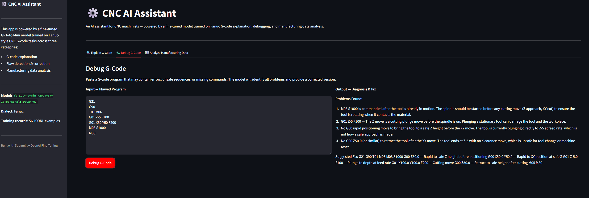

# CNC AI Assistant

A Streamlit web application powered by a fine-tuned GPT-4o Mini model trained on Fanuc-style CNC G-code tasks.



---

## What It Does

| Tab | Task |
|-----|------|
| 🔍 Explain G-Code | Line-by-line plain-English breakdown of Fanuc G-code programs |
| 🐛 Debug G-Code | Identifies safety hazards, missing commands, and sequencing errors — then provides a corrected program |
| 📊 Analyze Manufacturing Data | Interprets CSV machining data (tool wear, cycle time, error counts) for trends and recommendations |

---

## Why Fine-Tuned

General-purpose LLMs lack deep knowledge of CNC-specific conventions — Fanuc modal codes, safe startup sequences, cutter radius compensation activation, and what constitutes a dangerous G-code pattern (e.g., a cutting move before spindle start).

This model was fine-tuned on 56 hand-crafted JSONL training examples across three task categories, built specifically for this domain.

- **Base model:** `gpt-4o-mini-2024-07-18`
- **Fine-tuned model:** `ft:gpt-4o-mini-2024-07-18:personal::DeCanFUu`
- **Trained tokens:** 75,837
- **Training time:** 24.16 minutes

---

## Tech Stack

- Python 3.12+
- Streamlit
- OpenAI API
- python-dotenv

---

## Project Structure
cnc-ai-assistant/
├── app.py
├── requirements.txt
├── README.md
├── .env.example
├── .gitignore
├── screenshot.png
└── notebooks/
├── CNC_finetuning.ipynb
└── training_data.jsonl

## Local Setup

```bash
# 1. Clone the repo
git clone https://github.com/cronosus99/cnc-ai-assistant.git
cd cnc-ai-assistant

# 2. Install dependencies
pip install -r requirements.txt

# 3. Configure secrets
cp .env.example .env
# Edit .env and add your keys

# 4. Run
streamlit run app.py
```

### `.env` format
OPENAI_KEY=sk-...
MODEL_NAME=ft:gpt-4o-mini-2024-07-18:personal::DeCanFUu

---

## Training Data & Fine-Tuning

The `notebooks/` folder contains the full fine-tuning pipeline:

- `CNC_finetuning.ipynb` — dataset construction, JSONL formatting, and OpenAI fine-tuning job submission
- `training_data.jsonl` — 56 hand-crafted training examples across three task categories: G-code explanation, flaw detection & correction, and manufacturing data interpretation

The dataset covers Fanuc-specific conventions including modal G-codes, safe startup sequences, cutter radius compensation activation, and safety-critical correction examples such as spindle-after-cut bugs and G00 plunging into material.

---

## License

MIT